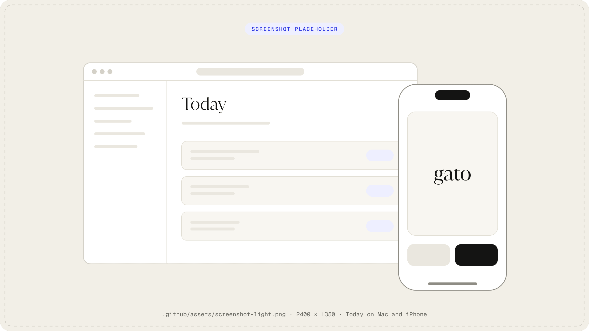
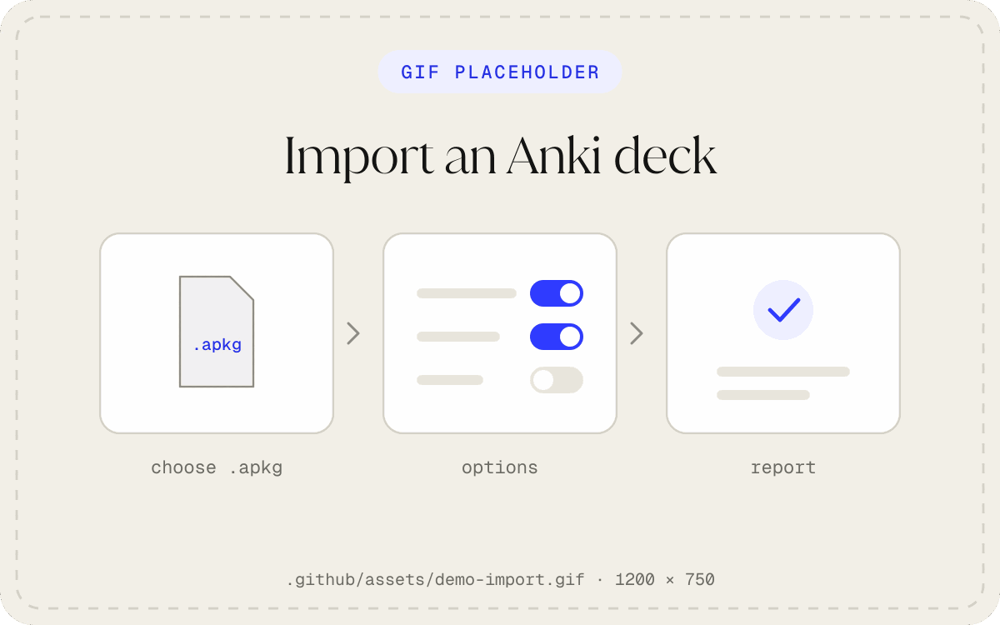
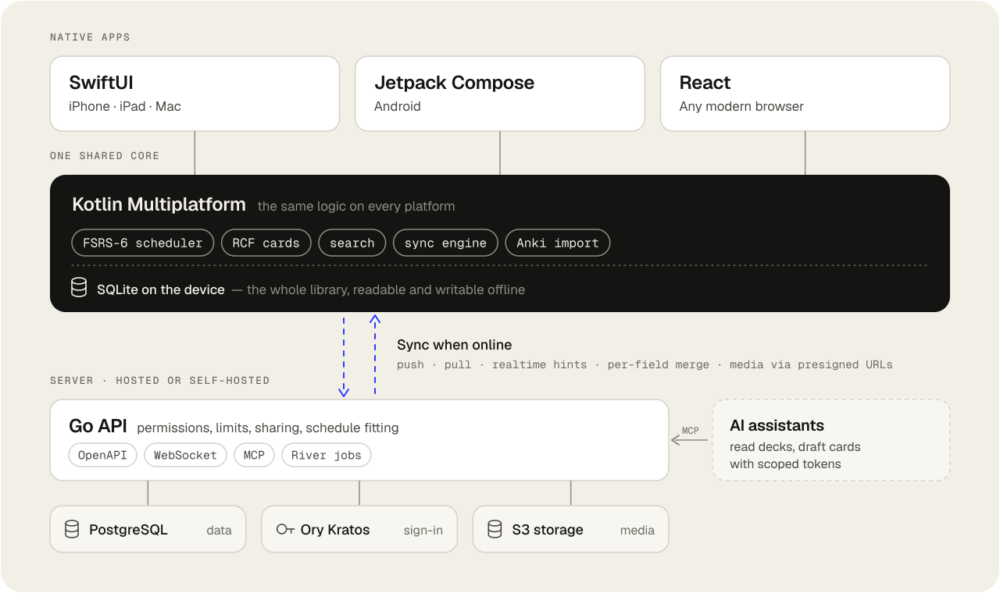

<p align="center">
  <picture>
    <source media="(prefers-color-scheme: dark)" srcset=".github/assets/hero-dark.svg">
    
  </picture>
</p>

<p align="center">
  <b>Open-source flashcards with a modern memory model.</b><br>
  FSRS scheduling, native apps for iPhone, iPad, Mac, Android and the web, offline-first sync,<br>
  and your Anki decks with their review history.
</p>

<p align="center">
  <a href="https://app.rondo.matthewsource.com"><b>Open the web app</b></a>
  &nbsp;·&nbsp;
  <a href="https://docs.rondo.matthewsource.com">Docs</a>
  &nbsp;·&nbsp;
  <a href="#coming-from-anki">Coming from Anki</a>
  &nbsp;·&nbsp;
  <a href="#run-your-own">Run your own</a>
  &nbsp;·&nbsp;
  <a href="#how-it-works">How it works</a>
</p>

<p align="center">
  <a href="LICENSE"></a>
  <a href="https://github.com/sourcelocation/rondo/actions/workflows/server.yml"></a>
  
  <a href="https://github.com/open-spaced-repetition/fsrs4anki/wiki/ABC-of-FSRS"></a>
</p>

> [!NOTE]
> Rondo is pre-release. Store builds and the hosted service at rondo.matthewsource.com are on their way; until then, [run it from source](#run-your-own).

<picture>
  <source media="(prefers-color-scheme: dark)" srcset=".github/assets/screenshot-dark.png">
  
</picture>

## Why Rondo

In music, a *rondo* is a form whose theme keeps returning between new episodes: **A B A C A D A**. Lasting memory forms the same way. What you're learning comes back between new material, a little later each time. Rondo schedules those returns and stays out of the way.

- **FSRS-6 scheduling.** You choose how much you want to remember (90% by default), and Rondo fits the schedule to your own answers.
- **Native on every device.** SwiftUI on iPhone, iPad and Mac, Jetpack Compose on Android, React on the web, all over one shared Kotlin core.
- **Offline first.** Every device keeps your whole library. Edits merge field by field, and reviews from two offline devices replay in order. There are no "keep this side or that side?" dialogs.
- **Cards without HTML.** Cloze, image occlusion, LaTeX, furigana and pinyin, typed answers and text-to-speech, all rendered natively and laid out for a phone or a 32″ monitor.
- **Your Anki decks, history included.** `.apkg` and `.colpkg` files are read on your device, with their media and reviews.
- **Study together.** Invite editors or publish a library. Everyone keeps their own schedule.
- **Works with AI assistants.** A built-in [MCP server](https://docs.rondo.matthewsource.com/agents) lets your assistant search decks and draft cards, using tokens you scope and revoke.
- **Open all the way down.** AGPL-3.0, a spec-first API, and a backend you can run with one command.

## Coming from Anki

1. In Anki, choose **File › Export** and pick **Anki Deck Package** or **Anki Collection Package**. Include scheduling and media.
2. In Rondo, choose **Import from Anki** and select the file. The package is read on your device; the web app never uploads it as a whole.
3. Check the report: notes, cards, reviews and media, plus anything that couldn't be converted.

<p align="center">
  
</p>

Your review history comes along, so cards continue on their current schedule. Supported note types become native Rondo cards. Other note types keep their fields and the rules that decide which cards exist. Anki's custom CSS and scripts don't carry over. [Full guide →](https://docs.rondo.matthewsource.com/importing)

## How it works

<picture>
  <source media="(prefers-color-scheme: dark)" srcset=".github/assets/architecture-dark.svg">
  
</picture>

- **Local-first.** Clients read and write their local SQLite copy and never wait on the network. Every write carries a hybrid logical clock. Changes merge last-writer-wins *per attribute*, and note fields merge per key.
- **Cards are derived, not synced.** A card's ID is a UUIDv5 of its note and template, so every device derives the same cards.
- **Reviews replay.** When the same card is studied on two offline devices, the server replays the reviews in order with your FSRS parameters.
- **Spec-first.** [`openapi.yaml`](server/api/openapi.yaml) generates the Go server interfaces, the Kotlin client and the API docs. Shared conformance fixtures run in both the Go and Kotlin test suites.

| Spec | What it defines |
| --- | --- |
| [Card format (RCF)](server/spec/card-format/README.md) | The block documents cards are made of, and how clients present them |
| [Sync protocol](server/spec/sync/README.md) | Scopes, clocks, merge rules, review replay, realtime and media |
| [Search language](server/spec/search/README.md) | One grammar for the app, the API and MCP: `deck:Spanish is:due -tag:verbs` |

## Run your own

The backend is one Go binary (API and worker) with PostgreSQL, [Ory Kratos](https://www.ory.sh/kratos/) for sign-in, and any S3-compatible store.

```bash
git clone https://github.com/sourcelocation/rondo.git
cd rondo/server
docker compose up -d --build
```

| Service | Address |
| --- | --- |
| API (OpenAPI at `/openapi.json`) | http://localhost:8080 |
| Sign-in (Ory Kratos) | http://localhost:4433 |
| Mail: sign-in codes arrive in Mailpit | http://localhost:8025 |
| Storage (RustFS, S3-compatible) | http://localhost:9000 |

Debug builds of every app connect to this stack as-is. To start the web app (Node 24+, pnpm, JDK 17+):

```bash
cd app/platforms/web
pnpm install
pnpm dev
```

It builds the shared Kotlin SDK with Gradle, rebuilds it as you edit, and serves the app at http://localhost:5173.

The compose file is for development, and its secrets are public. For a real deployment, [`server/deploy`](server/deploy/README.md) covers the k3s manifests, secrets, backups and webhooks. Release builds read their server address from `VITE_RONDO_API_URL` (web), [`Endpoints.swift`](app/platforms/apple/Sources/App/Endpoints.swift) (Apple) and `API_URL` in [`build.gradle.kts`](app/platforms/android/app/build.gradle.kts) (Android).

## Repository

Four standalone projects, each with its own toolchain, connected only through a few contract files (the API spec, the conformance fixtures and the design tokens).

| Project | Inside |
| --- | --- |
| [`server/`](server) | Go API, sync, background jobs and the MCP server: Echo, sqlc, Goose, River. Owns the API contract and the specs. |
| [`app/`](app) | One Gradle build: the Kotlin Multiplatform core (Room, Ktor, Koin) and the [Android](app/platforms/android), [Apple](app/platforms/apple) and [web](app/platforms/web) apps. |
| [`site/`](site) | The landing page (Astro) and the [docs](site/docs) (Fumadocs). |
| [`brand/`](brand) | Design tokens, fonts and artwork, compiled into CSS, Swift, Kotlin and Android resources. |

<details>
<summary><b>Build and test</b></summary>

```bash
# Server: lint, unit tests
cd server && golangci-lint run && go test ./...

# Shared core and apps: tests and checks for every module
cd app && ./gradlew check

# Android: install a debug build (forwards the local stack to the emulator)
cd app && ./gradlew :platforms:android:app:installDebug

# Apple: generate the Xcode project, then run the Rondo scheme
cd app/platforms/apple && xcodegen generate && open Rondo.xcodeproj

# Sites: landing on :4321, docs on :3001
cd site && pnpm install && pnpm dev
cd site && pnpm dev:docs
```

</details>

## Contributing

Issues and pull requests are welcome. For anything bigger than a fix, please open an issue first so we can agree on the approach. Changes to cards, sync or search start in the [spec](server/spec), and the conformance fixtures keep the Go and Kotlin implementations in step.

Contributions are accepted under the [Contributor License Agreement](CONTRIBUTOR_LICENSE_AGREEMENT.md), which lets the project be relicensed later (for example to offer commercial licenses). Questions: support@matthewsource.com.

## License

Rondo is free software under the [GNU Affero General Public License v3.0](LICENSE). The Rondo name, mark and logo are trademarks and are not covered by the license. Forks need their own name and mark; see [`brand/artwork`](brand/artwork/README.md).
